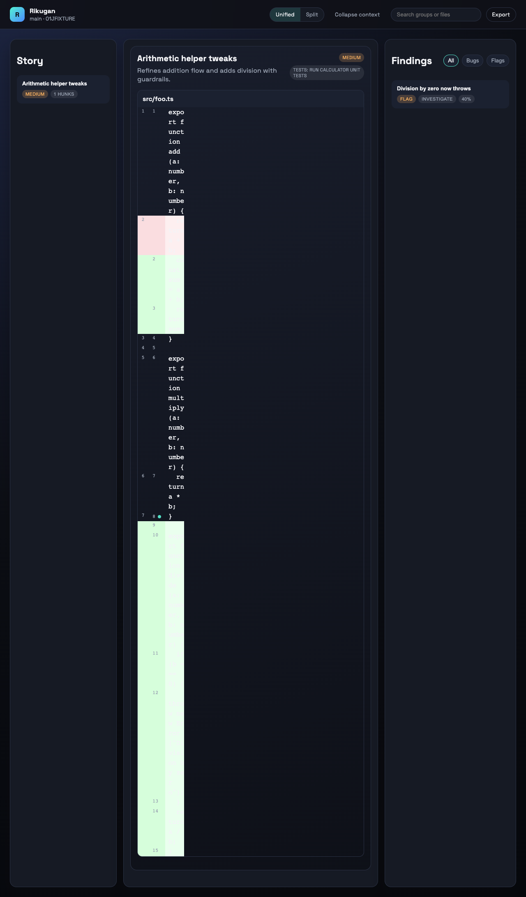

# Rikugan

[](https://www.npmjs.com/package/rikugan)
[](https://www.npmjs.com/package/rikugan)
[](LICENSE)

Local-first code review: turn a local git diff into a browser-first review story with grouped changes,
hoverable inline notes, and a findings sidebar. Rikugan shells out to `codex exec` in non-interactive
mode with schema-validated JSON outputs.



## Prerequisites

- Node.js 18+ LTS (tested on Node 20)
- `git`
- OpenAI Codex CLI installed and authenticated (Rikugan uses `codex exec`)

## Install

```bash
npm i -g rikugan
```

Package page: [npmjs.com/package/rikugan](https://www.npmjs.com/package/rikugan)

One-off usage without a global install:

```bash
npx rikugan review --diff-file path/to.diff
```

## Quick start

```bash
# verify git + codex are available
rikugan doctor

# review staged changes (or use --uncommitted)
rikugan review --staged

# reopen the most recent run
rikugan open --latest
```

For non-git diffs, use `--diff-file` or `--diff-stdin`.

## Common workflows

| What you want | Command |
| --- | --- |
| Review staged changes | `rikugan review --staged` |
| Review working tree changes | `rikugan review --uncommitted` |
| Review a commit or range | `rikugan review --commit <sha>` or `rikugan review --range A..B` |
| Review a diff file / stdin | `rikugan review --diff-file path/to.diff` or `rikugan review --diff-stdin` |
| Headless review output (stdout) | `rikugan review --staged --format json` |
| Open latest run | `rikugan open --latest` |
| Export a run | `rikugan export <runId> --format html|md|json --out <dir>` |

## Diff sources & options

- `--staged`, `--uncommitted`
- `--range A..B`, `--commit <sha>`, `--since <ref>`
- `--diff-file <path>`, `--diff-stdin`
- `--paths <glob...>`
- `--format ui|json|md|html`

## Features

- Browser-first review UX (grouped story + findings + inline annotations)
- Unified / split diff toggle
- Hover tooltips for annotations
- Findings sidebar with jump-to-evidence
- Local run persistence under `.rikugan/runs/<runId>/`
- `codex exec` only (read-only sandbox, schema-validated outputs)

## Runs & exports

- Runs are stored under `.rikugan/runs/<runId>/` in your repo.
- Export with `rikugan export <runId> --format html|md|json --out <dir>`.

## Data & privacy

Rikugan does not call AI APIs directly. It shells out to `codex exec`, so your data handling depends on
your Codex provider settings.

## Troubleshooting

- `rikugan doctor` checks `git`, `codex`, and runtime dependencies.
- `rikugan cache clear` resets local caches.
- If you see “Codex is not available,” confirm `codex --version` works and you are authenticated.

## Commands

- `rikugan review`
- `rikugan list`
- `rikugan open`
- `rikugan serve`
- `rikugan export`
- `rikugan doctor`
- `rikugan config`
- `rikugan cache clear`

## Development

```bash
pnpm install
pnpm -C packages/rikugan test
```

## Codex skill

This repo includes a packaged Codex skill for running Rikugan from Codex or other agents:

```
skills/rikugan-cli.skill
```

To install it in your global Codex skills directory:

```bash
cp skills/rikugan-cli.skill ~/.codex/skills/
```

Then in Codex, explicitly ask to run Rikugan (e.g. “run rikugan review --staged”).

## License

MIT
